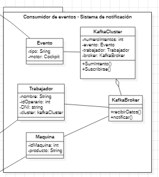

# Notificar y suscribirse a eventos - ADR-003

## Status

Approved

## Decisores

* Santiago Arias - ASS
* Vicente González - ASC
* Irene Pérez - ASS
* Ángel Covarrubias - ASC

*Esta decisión ha sido grabada*

## Date

* 2022-11-02, (actualizado) 2022-11-08

## Context and Problem Statement

Necesitamos notificar a los operarios de la factoría, así como permitirles suscribirse a diferentes eventos y notificaciones.

## Decision drivers

RF3, RF3.1

## Considered Options

* [MQTT](https://github.com/4rius/DAS-P4/blob/main/Semana%203/Decisiones/Denegadas/ADR-012-MQTT-Denegada.md)
* Apache Kafka
* [Diseño propietario del patrón Publish-Subscribe](https://github.com/4rius/DAS-P4/blob/main/Semana%203/Decisiones/Denegadas/ADR-013-PublishSubscribe-Denegada.md)

## Decision Outcome

Opción elegida: "Apache Kafka", al proporcionar soporte para el envío de mensajes entre dispositivos IoT, y la posibilidad de suscribirse a los operarios, además del procesamiento del flujo de datos enviado por los dispositivos de la fábrica.

### Positive Consequences

* Admite cantidades grandes de datos. Esta plataforma puede lidiar con todo el flujo de datos de los dispositivos IoT, y gestionar los envíos de mensajes a los operarios suscritos.

* Buena integración con el resto del sistema. De hecho, puede ayudar al sistema de las analíticas, al procesar grandes cantidades de datos.

* Escalable. Se pueden conectar miles de dispositivos IoT y operarios, que el sistema podrá seguir funcionando.

* Reprocesado de eventos. Kafka deja revisar los eventos que se han producido al guardarlos en disco, podremos configurar cuánto tiempo queremos guardar esta información, pero será útil para generar estadísticas.

## Negative Consequences

* Conexión. Requiere una conexión de calidad para que los envíos y recepciones estén aseguradas.
* Limitaciones. No es una plataforma pensada para cientos de miles de dispositivos.

## Other options

### [MQTT](https://github.com/4rius/DAS-P4/blob/main/Semana%203/Decisiones/Denegadas/ADR-012-MQTT-Denegada.md)

* Bueno, por ser fácil de implementar solo necesitando 3 nuevos componentes. [3]
* Malo, Estamos asumiendo que los mensajes se van a enviar solo en los momentos en los que ocurrra un evento, con este protocolo no podríamos asumir cantidades masivas de datos siendo enviadas constantemente, al final es una implementación del patrón Publish-Subscribe.
* Malo, porque no procesa la información, es solo un protocolo de envío de mensajes.

### [Diseño propietario del patrón Publish-Subscribe](https://github.com/4rius/DAS-P4/blob/main/Semana%203/Decisiones/Denegadas/ADR-013-PublishSubscribe-Denegada.md)

* Bueno, por la facilidad en su implementación y carencia de fallos.
* Malo, por tener que programar un patrón ya implementado.
* Malo, por la posibilidad del "Lapsed Listener Problem" [2].
* También es una mala decisión porque el MQTT es prácticamente lo mismo, ahorrándonos la programación.

## Related Artifacts

