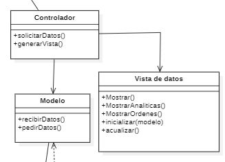

# Decisión Mostrar las analíticas - ADR-004
## Status

```diff
+ Approved
```

## Decisores

* Ángel Covarrubias - ASC
* Santiago Arias - ASS

## Date

* 2022-11-05, actualizado 2022-11-18

## Context and Problem Statement

Necesitamos poder mostrar las analíticas en tiempo real del proceso productivo y las órdenes de trabajo.

## Decision drivers

RF1, RF1.1

## Considered Options

* Modelo Vista Controlador

## Decision Outcome

Opción elegida: "Modelo Vista Controlador", con este patrón aseguramos que la lógica está separada de su visualización. 

### Positive Consequences

* Bajo coste computacional. Si no se aplica un MVC en este caso, no tendría sentido la cantidad de poder computacional que necesitaríamos para poder abrir una simple interfaz, teniendo un controlador dedicado específicamente para sacar los datos y procesarlos por pantalla, reducimos esta necesidad computacional, así como tiempos de carga y mejoraríamos la visión de estadísticas en tiempo real.

* Fácil de extender. Nos permitirá añadir nuevas analíticas que vengan de otros dispositivos nuevos o existentes, sin tener que reimplementar nada, utilizando los módulos ya existentes.

* Separación de componentes. Se asegura de que la lógica va a estar separada de la visualización de analíticas ahorrándonos futuros problemas.   

## Negative Consequences

* No se podría implementar si los datos recibidos del proceso productivo no llegan correctamente, al igual que si las ordenes de trabajo no son las adecuadas producirían que los datos expuestos en las analíticas sean incorrectos.

## Related Artifacts

