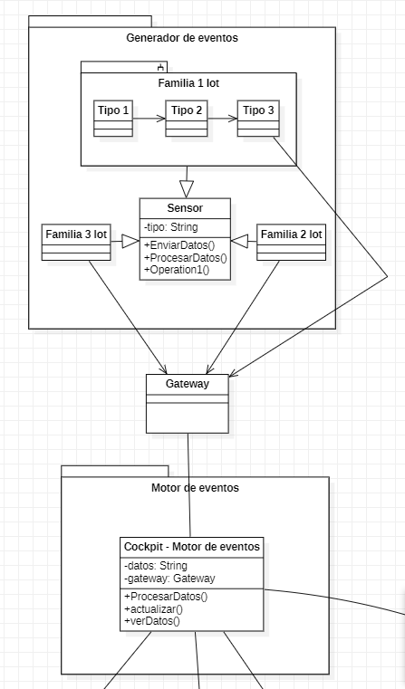

# Adaptación de datos de los sensores- ADR-008

## Status

proposed

## Decisores:

Vicente González - ASC 

Irene Pérez - ASS

## Date

2022-11-07

## Context and Problem Statement

Se requiere una forma de comunicar los sensores IoT con el resto de la arquitectura.

## Decision drivers

RF6

## Considered Options

* Conectar los sensores con un gateway

## Decision Outcome

Todos los sensores se comunicaran con un único gateway, este sera el encargado de procesar y enviar los datos al centro de notificaciones.

### Positive Consequences

* Permite la comunicación entre los sensores y el sistema.
* Permite la comunicación entre sensores.
* Preprocesa los datos recibidos para reducir el volumen de datos que recibe el sistema.
* Añade seguridad al sistema.

## Negative Consequences

* Añade complejidad al sistema.

## Related Artifacts

